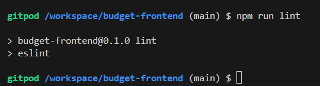
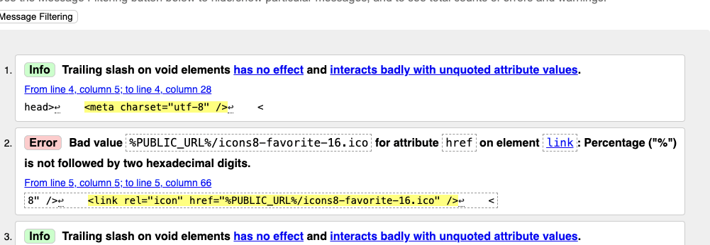
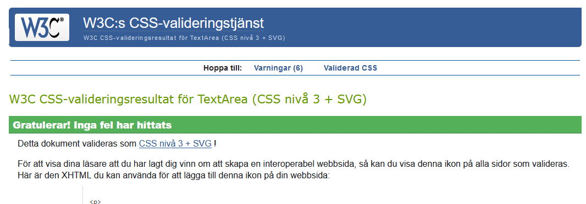
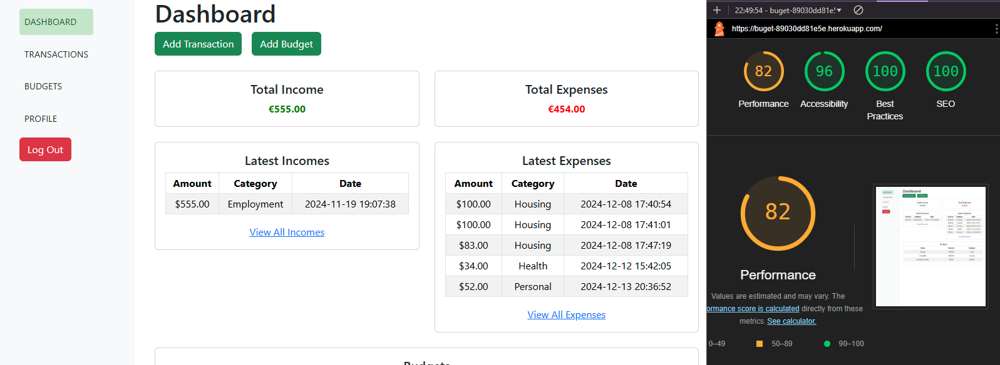
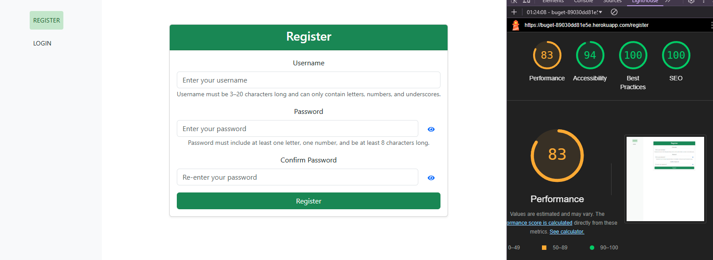
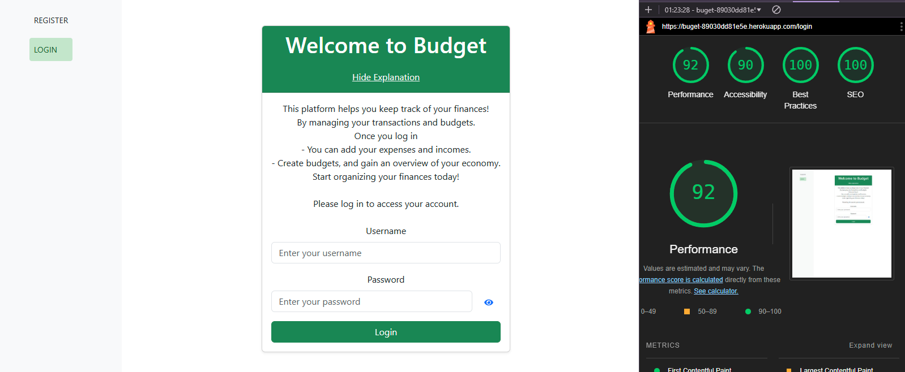
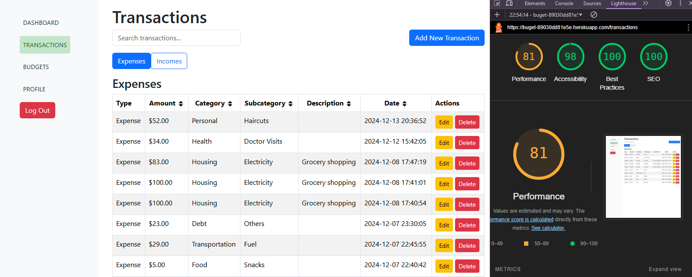
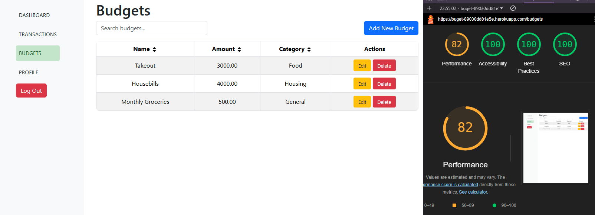
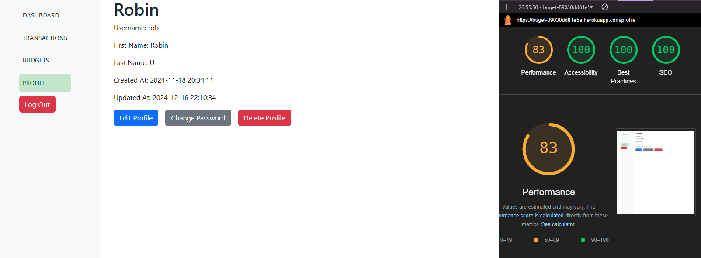
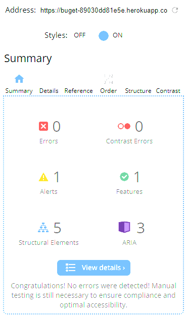

The Budget project welcomes users to try and empower themself to take control of their finances by providing a seamless, user-friendly platform to track expenses, create and manage budgets, and gain insights into their spending habits, enabling them to achieve their financial goals and build better money management skills. You can visit the live site here: [Budget](https://buget-89030dd81e5e.herokuapp.com/)

## <a id="table-of-content">Table of Content</a>

- [Introduction](#introduction)
- [Agile Methodology](#agile-methodology)
- [API](#api)
- [User Experience (UX)](#user-experience-ux)
  - [The Strategy](#the-strategy)
  - [The Scope](#the-scope)
  - [The Structure](#the-structure)
  - [The Skeleton](#the-skeleton)
  - [The Surface](#the-surface)
- [User Stories](#user-stories)
- [Project Overview](#project-overview)
  - [Learning Objectives](#learning-objectives)
  - [Assignment Requirements](#assignment-requirements)
  - [Self-Assessment](#self-assessment)
  - [Reusable Components](#reusable-components)
- [Features](#features)
  - [The Features](#gifs)
  - [Future Features](#future-features)
- [Technologies Used](#technologies-used)
  - [Tools](#tools)
  - [Languages](#languages)
  - [Frameworks & Libraries](#frameworks-and-libraries)
- [Testing](#testing)
  - [Validation](#validation)
  - [Lighthouse Test](#lighthouse)
  - [Browser Test](#browser-test)
  - [Wave](#wave)
  - [Bugs](#bugs)
- [Setup and deployment](#setup-and-deployment)
  - [Create Repository](#create-repository)
  - [Version Control](#version-control)
  - [Deployment to Heroku](#deployment)
  - [Clone and Fork](#clone-and-fork)
- [Documentation](#documentation)
  - [Project documentation](#project-documentation)
- [Credits](#credits)
  - [Content](#content)
  - [Media](#media)
  - [Thank You](#thank-you)

## <a id="introduction">Introduction</a>

## <a id="agile-methodology">Agile Methodology</a>

This is my Kanban board for this project.

The Kanban board is an essential tool for tracking progress and ensuring efficient project management. It is organized into several columns: To Do, In Progress, Done, Bugs.

- To Do: Tasks that are planned and ready to be worked on.
- In Progress: Tasks that are currently being worked on.
- Done: Completed tasks.
- Bugs: Identified issues that need to be fixed.

Using the Kanban board has helped me maintain a clear overview of the project, ensuring that tasks are properly tracked, prioritized, and completed efficiently. While the Kanban board focuses on higher-level planning and project progress, I have also developed detailed user stories for each specific feature of the application, documenting how different parts of the project align with user needs and goals.

This approach allows for both a broader view of the project timeline and detailed insight into how individual functionalities are built and integrated.

I find this combination of Kanban and detailed user stories essential for staying organized and focused, and I look forward to further developing these skills in future projects!
You can visit the Knaban board here:
[Kanban](https://github.com/users/NiborGnu/projects/13)

## <a id="api">API</a>

The Budget app utilizes an API built with Django Rest Framework. For more details, please visit the
[repository](https://github.com/NiborGnu/budget-my-life-api-backend)

## <a id="user-experience-ux">User Experience (UX)</a>

### <a id="the-strategy">The Strategy</a>

Read The Strategy

The goal of the Budget economy app is to empower users to take control of their finances by providing a seamless, user-friendly platform to track expenses, create and manage budgets, and gain insights into their spending habits, enabling them to achieve their financial goals and build better money management skills.

### <a id="the-scope">The Scope</a>

Read The Scope

The scope of the Budget economy app includes:

1. User Profiles:

- Allow users to create and customize their profiles.
- Enable users to follow and interact with other users.

2. Transactions:

- Enable users to add Transactions and get a overwiev.
- Allow users to choose a category for their Transactions.

3. Budgets:

- Enable users to add Budgets and get a overwiev.

4. LikesDashbord:

- For a saml overwiev of both transactions and budgets.

6. Search and sort:

- Serch end sort Transactions and budget by category, name, date, description and amount

 

### <a id="the-structure">The Structure</a>

Read The Structure

The structure of the Budget economy app will include the following components:

1. Front-End:

- User Interface: Designed with a focus on user experience and ease of use.
- React Components: Modular components for transactions, budgets, profile pages, and navigation.

2. Back-End:

- Django Rest Framework API: Handles user authentication, data storage, and API requests.
- Database: Stores user data, budgets, transactions, and categories/subcategories.

### <a id="the-skeleton">The Skeleton</a>

Read The Skeleton

The skeleton of the Budget economy app outlines the basic structure and layout of the application based on the provided 

ERD

. The diagram shows the relationships between users, profiles, posts, comments, likes, and followers, which guide the overall structure of the app.

# User Stories for Pages

## 1. **Sign In Page**

- **Login Form:**

  - Allow users to log in using their username and password.

- **Error Handling:**
  - Display an error message if the login credentials are incorrect.
  - Provide guidance if the user is unable to log in due to incorrect information.

---

## 2. **Sign Up Page**

- **Registration Form:**

  - Allow users to create a new account by entering their username, password, and confirm password.
  - Provide a link to the "Sign In" page for existing users.

- **Error Handling:**
  - Display error messages for invalid inputs (e.g., weak passwords, username already taken).

---

## 3. **Dashboard Page**

- **Overview of Transactions and Budgets:**

  - Provide a quick overview of the user’s latest transactions and budgets.

- **Quick Actions:**
  - Allow users to quickly go to transaction or budget directly from the dashboard.
  - Display links to detailed pages for transactions for more management options.

---

## 4. **Transactions Page**

- **List of Transactions:**

  - Display all transactions in a list format, including details like date, description, amount, and category.
  - Allow users to filter transactions by date, category, subcategory, or amount.
  - Include options for sorting transactions by date, amount, or type.

- **Create, Edit, and Delete Transactions:**

  - Provide a form to add new transactions with fields for description, amount, date, and category.
  - Allow users to edit or delete existing transactions directly from the list.

- **Search Functionality:**
  - Include a search bar to quickly find specific transactions by keywords, amount, or category.

---

## 5. **Budgets Page**

- **List of Budgets:**

  - Display all budgets created by the user, including the name, amount allocated, and category.

- **Search Functionality:**

  - Include a search bar to quickly find specific budget by keywords, amount, or category.

- **Create, Edit, and Delete Budgets:**
  - Provide a form to create new budgets, with fields for name, category, allocated amount.
  - Allow users to edit or delete existing budgets.

---

## 6. **Profile Page**

- **User Information:**

  - Display user details such as username, name, creation date.
  - Allow users to edit their personal information and delete the user.

- **Edit Profile:**
  - Allow users to update their profile information, including their name and username.
  - Include the option to change the password.

### The Wireframes can be found here:

Sign in

Profile Page

Dashbord Page

Budgets Page

Transactions Page

### <a id="the-surface">The Surface</a>

The Surface

The visual design of the budget application is aimed at creating a calming and inviting environment where users feel comfortable sharing their emotions and safe spots. Below is a breakdown of the key design elements that contribute to the app’s aesthetic and user experience.

**Typography**

The design of the budget app uses a clean, modern aesthetic with soft, soothing colors to create a calming user experience. The primary typefaces are Lato for body text, providing clarity and readability, and Roboto for headings, offering a modern and bold contrast.

**Color Scheme**

- Primary colors like white (#ffffff) and light gray (#f8f9fa) create a clean and neutral background.
-     Accent colors include:
- Red (#DC3545) As a vibrant and bold shade of red, this color naturally attracts the eye and prompts user interaction.
- Blue (#0D6EFD) for interactive elements like buttons and links, adding a calming tone.
- Green (#155724, #198754) for important actions, bringing energy to key interactions.
- Black (#212529) for strong contrast in text and buttons, ensuring readability.

These choices combine to create a simple, welcoming, and easy-to-navigate interface.

**Layout**

- Consistency: Uniform layouts across all pages to provide a seamless user experience. The navigation structure remains the same across the app to ensure familiarity.
- Spacing: Ample white space between elements to keep the design clean and easy to read. The balance between elements enhances the visual experience without overwhelming the user.
- Responsive Design: The app is fully responsive, adjusting to different screen sizes on mobile devices, tablets, and desktops, ensuring usability across all platforms.

**User Interface Components**

- Buttons: Rounded buttons with soft shadows are used for interaction, making it clear where users can engage. Informative text are integrated into these buttons, adding a visually engaging touch that enhances user interaction and navigability.
- Forms: User-friendly forms with spacious input fields and clear labels. Input validation ensures users receive feedback on any errors.
- Menus: Dropdown menus for editing or deleting posts,comments and editing profiles, along with a hamburger navigation for mobile users, provide easy access to various features without cluttering the interface. These streamlined options ensure that users can manage their content efficiently while maintaining a clean, organized layout.

These design elements are carefully selected to create a peaceful, intuitive, and emotionally engaging environment for users, aligning with the platform’s goal of fostering safe, meaningful emotional expression.

## <a id="user-stories">User Stories</a>

# User Stories

| Feature                                  | User Story                                                                                                                                                                              | Acceptance Criteria                                                                                                                                                                                                                                                         |
| ---------------------------------------- | --------------------------------------------------------------------------------------------------------------------------------------------------------------------------------------- | --------------------------------------------------------------------------------------------------------------------------------------------------------------------------------------------------------------------------------------------------------------------------- |
| **User Backend**                         | As a User, I want to Register, login, logout and view, edit, delete my profile so that I can make an account and create my budget.                                                      | 1. Registration page with sign-up form.   2. Login page with form for credentials.   3. Profile page displaying user's information.   4. Edit profile page for updating user details.   5. Option to delete the profile.   6. Password update functionality. |
| **Transactions Backend**                 | As a User, I want to Create, edit, view and delete transactions so that I can keep track of my transactions.                                                                            | 1. A form for creating new transactions.   2. A page to view all transactions.   3. An edit form for updating transactions.   4. A delete option for removing transactions.                                                                                        |
| **Budget Backend**                       | As a User, I want to Create, edit, view and delete budgets so that I can keep track of my budget.                                                                                       | 1. A form for creating a new budget.   2. A page to view budgets.   3. An edit form for modifying budgets.   4. A delete option for removing budgets.                                                                                                              |
| **Categories and Subcategories Backend** | As a user/admin, I want to be able to use categories for my budgets and categories/subcategories for my transactions so that I can sort them and find what I'm looking for more easily. | 1. Option to create categories and subcategories for transactions and budgets.   2. View categories for transactions and budgets.   3. Only admins can edit or delete categories/subcategories.                                                                       |
| **Login/Register**                       | As a user, I want to register and login so that I can keep track of my transactions.                                                                                                    | 1. A login page where users can input their credentials.   2. A register page where users can create an account.                                                                                                                                                         |
| **Dashboard**                            | As a user, I want to see an overview of my latest transactions and budgets so that I can keep myself up to date.                                                                        | 1. A dashboard page displays the latest transactions and budgets.   2. The dashboard provides an overview of user activity.                                                                                                                                              |
| **Transactions**                         | As a user, I want to see, create, update, delete, sort, and search for my transactions so that I can keep track of my transactions.                                                     | 1. A transactions page to view all transactions.   2. Ability to create, update, delete transactions.   3. Sorting and searching options for transactions.                                                                                                            |
| **Budgets**                              | As a user, I want to be able to create, edit, view and delete budgets so that I can see what I have for the specific thing.                                                             | 1. A budget page to view all budgets.   2. Ability to create, edit, and delete budgets.                                                                                                                                                                                  |
|                                          |

## <a id="project-overview">Project Overview</a>

### <a id="learning-objectives">Learning Objectives</a>

Learning Objectives

This project focuses on achieving the following learning and development goals:

Click to show Learning objectives

1. Mastery of Full-Stack Development: Build a solid foundation in both frontend (React, Bootstrap) and backend (Django REST Framework) technologies, ensuring seamless interaction between client and server-side functionalities.
2. Proficiency in API Consumption: Learn to effectively consume and integrate APIs in the frontend, leveraging React for dynamic user interactions.
3. Responsive Web Design: Ensure the application adjusts to different device screen sizes using Bootstrap, providing a smooth user experience across all platforms.
4. Component Reusability: Develop a modular and maintainable codebase by creating reusable components and separating logic within the application.
5. Project Management and Version Control: Employ Git and GitHub for efficient version control and task tracking throughout the project lifecycle.
6. Security and Best Practices: Focus on securing the application, including API key management, authentication, and user access control.
7. Testing and Deployment: Engage in manual and automated testing to ensure the application is free of bugs and issues before deployment. Additionally, deploy the application to a cloud platform like Heroku for real-world accessibility.

### <a id="assignment-requirements">Assignment Requirements</a>

Assignment Requirements

A breakdown of the essential requirements for the project, as outlined by the educational curriculum:

Click to show Assignment Requirements 

1. Full-Stack Web Application: Develop a functional web application that allows users to create, edit, and interact with transactions, budgets and profiles.
2. User Authentication: Implement secure user authentication using Django REST Framework and React, allowing users to register, sign in, and manage their profiles.
3. API-Driven Development: Build a comprehensive REST API for transactions, budgets and profile management, ensuring proper CRUD functionality and data validation.
4. Responsive Design: Ensure that the frontend adapts smoothly across different screen sizes using Bootstrap and costum css for a responsive and accessible UI.
5. Interactive User Experience: Design an intuitive and user-friendly interface where users can interact with the application’s features (e.g., transactions, budgets) in real time.
6. Comprehensive Documentation: Document the project thoroughly, including the API structure, frontend and backend setup, and deployment process in the README files.
7. Version Control and Commit Messages: Use Git for source control, ensuring consistent and meaningful commit messages to track the development process.
8. Manual Testing and User Feedback: Implement thorough manual testing across different browsers and platforms, and gather feedback to refine the application.

### <a id="self-assessment">Self-Assessment</a>

Self-Assessment

This section provides an evaluation of the project development process, including challenges faced, lessons learned, and areas for improvement.

Click to show Self-Assessment 

1. Learning Reflection: This project has greatly enhanced my understanding of full-stack development, particularly with React on the frontend and Django REST Framework on the backend. Implementing the API and integrating it with the React components was a rewarding challenge.
   - Highlights: One of the most valuable lessons was learning how to structure a React application with reusable components, especially in handling forms and API integration. This allowed me to build a more modular and scalable frontend. Moreover, the authentication process using Django REST Framework gave me hands-on experience with securing an application.
   - Challenges: The most significant challenge was managing state in React, particularly when dealing with complex forms (e.g., transactions, budgets creation with category and subcategory fields). Additionally, configuring and securing API endpoints to ensure proper data validation required additional focus.
   - Achievements: Successfully deploying the full application, with both frontend and backend seamlessly connected via the API, stands out as a major achievement. Implementing dynamic forms and secure user authentication added depth to the project.
2. Areas for Improvement: While I have made progress, there are areas for improvement, especially in optimizing API performance and managing complex state in React.

### <a id="reusable-components">Reusable Components</a>

This application features reusable components, which help maintain scalability and efficiency. Below are examples:

Click to show components

#### NavBar Component:

- Purpose: Provides navigation across the application, showing sign-in options, links to transactions, budgets, dashbord and profile.
- Reusability: The NavBar is used across all app routes to maintain consistent navigation.
- Props: Displays dynamic links based on user authentication status.

#### Table component:

- Purpose: Allow user to sort and search.
- Reusability: Used in transactions, budgets.
- Props: Functions like SortConfig, SearchQuery.

#### Profile Component:

- Purpose: Displays user profile details.
- Reusability: Used on the profile page for all users.

 

## <a id="features">Features</a>

### <a id="the-features">The Features</a>

#### On pc

All links and forms have been tested and working

#### Mobile mode

All links and forms have been tested on mobile and works

### <a id="future-features">Future Features</a>

Click to show more Future Features

1. Direct Messaging:
   - Allow users to send and receive private messages between one another. This feature would include:
   - A messaging interface for users to manage conversations.
   - Notifications for new messages.
   - The ability to share budgets with other users.
2. Notifications System:
   - Direct messages.

## <a id="technologies-used">Technologies Used</a>

Click to show technologies

1. **React (v18.3.1)**: The core JavaScript library used to build the user interface of the app. React enables efficient creation of reusable, state-driven components and dynamic rendering.
2. **React Router DOM (v7.0.2)**: A client-side routing library for React, facilitating smooth navigation between app pages while maintaining a single-page application structure.
3. **Axios (v1.7.9)**: A promise-based HTTP client used for API calls. Axios simplifies data fetching, handles HTTP headers, and supports interceptors for token management in authentication workflows.
4. **React Bootstrap (v2.10.6)**: A React implementation of Bootstrap components, enabling the use of pre-built, responsive UI elements to speed up development while maintaining consistency.
5. **Bootstrap (v5.3.3)**: A popular CSS framework used for styling and layout. Bootstrap ensures responsive and modern designs with minimal effort.
6. **Reactstrap (v9.2.3)**: Provides Bootstrap 5 components as React components, allowing for customizable and dynamic UI components.
7. **React Icons (v5.4.0)**: A library of popular SVG-based icons, offering a wide selection of icons for easy integration into React components.
8. **@tanstack/react-query (v5.62.7)**: A library for managing server state in React applications, simplifying data fetching, caching, and synchronization with APIs.
9. **Prop-Types (v15.8.1)**: A type-checking library for React props, ensuring that components receive the expected types and improving reliability.
10. **dotenv (v16.4.7)**: A library to load environment variables from a `.env` file, enabling secure configuration management.
11. **Web Vitals (v2.1.4)**: A performance measurement library for monitoring and improving the quality of user experiences.
12. **@testing-library/react (v13.4.0)**: A library for testing React components, focusing on testing user interactions and accessibility.
13. **@testing-library/user-event (v13.5.0)**: Provides utilities to simulate user interactions in tests, such as clicks and typing.
14. **@testing-library/jest-dom (v5.17.0)**: Custom matchers for asserting DOM elements in tests, improving test readability and accuracy.
15. **ESLint (v8.57.1)**: A tool for identifying and fixing JavaScript code issues, ensuring adherence to coding standards and best practices.
16. **TypeScript ESLint (v8.18.1)**: A set of ESLint plugins and configurations for linting TypeScript code in the project.
17. **Git & GitHub**: Used for version control and collaborative development. Git tracks changes in the codebase, while GitHub serves as the cloud repository for storing, reviewing, and sharing the project's source code.

### <a id="languages">Languages</a>

Click to show languages

1. HTML – used for structuring the content of the React components.
2. CSS – used for styling the web application.
3. JavaScript – the main programming language used with React to build dynamic web applications.

### <a id="tools">Tools</a>

Click to show Tools

- **Visual Studio Code (VS Code)**: A lightweight and versatile code editor with robust features such as IntelliSense, debugging, and Git integration. Used initially during the project for its extensive extensions marketplace and customizable development environment.
- **Git**: Used for version control, enabling tracking of changes and collaboration through branches and commits.
- **GitHub**: A platform for hosting the project’s Git repositories, also used for managing tasks and issues.
- **ESLint**: A tool used for identifying and fixing code quality and syntax errors in JavaScript, ensuring consistent code standards.
- **Balsamiq**: Employed to design wireframes, helping plan the layout and user interface before development began.
- **Heroku**: A cloud platform used to deploy the application, making it accessible online.

### <a id="frameworks-and-libraries">Frameworks & Libraries</a>

Click to show Frameworks

- **React 18.3.1**: The core JavaScript library for building the app's user interface, focusing on creating reusable components and managing the UI efficiently.
- **React Bootstrap 2.10.6**: Integrated for ready-made, responsive UI components based on the Bootstrap framework, ensuring a consistent design across the app.
- **React Router DOM 7.0.2**: A client-side routing library for React, allowing seamless navigation between app pages without full page reloads.
- **Axios 1.7.9**: A modern, promise-based HTTP client for interacting with REST APIs, used for fetching and sending data.
- **Bootstrap 5.3.3**: A CSS framework used alongside React Bootstrap to ensure responsive and visually appealing designs.
- **Prop-Types 15.8.1**: A library for type-checking React props, helping to enforce correct usage of components and improve code reliability.
- **React Icons 5.4.0**: Provides a rich library of popular SVG icons for easy integration into React components.
- **Reactstrap 9.2.3**: Adds Bootstrap 5 components as React components, allowing for dynamic, reusable UI elements.
- **dotenv 16.4.7**: A library to load environment variables from a `.env` file, used for configuration management and secure storage of sensitive data.
- **Web Vitals 2.1.4**: A library for measuring key performance metrics in React apps to ensure high-quality user experiences.

## <a id="testing">Testing</a>

Manual testing were preformed. The results are shown here
[Test](TEST.md)

### <a id="validation">Validation</a>

- The React code was validated using ESLint. You can view the results here.
  

- The HTML code was validated with https://jigsaw.w3.org/css-validator/.

Click to show HTML validation

Note: During the validation of the index.html file, there are some warnings related to the usage of %PUBLIC_URL%. This placeholder is used in React applications created with Create React App (CRA) to correctly reference resources (such as icons and manifests) from the public directory. These warnings do not affect the functionality of the application and are resolved when the app is built for production, as %PUBLIC_URL% is replaced with the correct path.

 

- The CSS code was validated with https://jigsaw.w3.org/css-validator/#validate_by_input All the results looked like this:

Click to show CSS validation

### <a id="lighthouse">Lighthouse Test</a>

Lighthouse test was made for a number of pages with the following results:

Click to show Homes Lighthouse test

Click to show Sign Up Lighthouse test

Click to show Sign In Lighthouse test

Click to show Transacations Lighthouse test

Click to show Budgets Lighthouse test

Click to show Profiles Lighthouse test

### <a id="browser-test"> Browser Test </a>

I tested the application on following browsers:
| **Browser** | **Operating System** | **Result** |
|--------------------|----------------------|--------------------|
| Google Chrome | macOS Sonoma | Passed |
| Mozilla Firefox | Windows 11 | Passed |
| Microsoft Edge | Windows 11 | Passed |
| Mozilla Firefox | Android 14 | Passed |
| Mozilla Firefox | Android 14 | Passed |
| Opera | Android 14 | Passed |
| Safari | Android 14 | Passed |

### <a id="wave">Wave</a>

I tested the home page with wave. This is the result:

 

Click to show Wave

### <a id="bugs">Bugs</a>

The bugs are shown in the [Kanban](https://github.com/users/JorgenDIF/projects/7) board

## <a id="setup-and-deployment">Setup and Deployment</a>

### <a id="create-repository">Create Repository</a>

Step-by-step guide on creating a new repository from the Gitpod Full Template by Code Institute.

Click to expand

**Log in to GitHub:**

1. Open your web browser and navigate to GitHub.
2. If you are not already logged in, enter your GitHub username and password to log in.

**Access the Gitpod Full Template:**

1. Go directly to the Gitpod Full Template repository.

**Create a New Repository Using the Template:**

1. On the template repository page, look for the green button that says "Use this template". Click on this button.
2. You will be redirected to the "Create a new repository from gitpod-full-template" page.

**Configure Your New Repository:**

1. Repository name: Enter a name for your new repository.
2. Repository description (optional): Provide a brief description of your repository.
3. Privacy settings: Choose whether the repository should be Public (anyone can see this repository) or Private (you choose who can see this repository).
4. Leave the "Include all branches" checkbox unchecked if you just need the main branch; check it if you need all branches from the template.

**Create the Repository from the Template:**

1. Click the "Create repository from template" button to create your new repository with the contents of the Gitpod Full Template.

**Access Your New Repository:**

1. Once the repository is created, you will be redirected to your new repository page on GitHub.

### <a id="version-control">Initialize in VS Code</a>

Version Control

 
The site was created using the Gitpod editor and pushed to github to the remote repository ‘pixavibe-frontend’.
The following git commands were used throughout development to push code to the remote repo:

- `git add <file>` - This command was used to add the file(s) to the staging area before they are committed.
- `git commit -m “commit message”` - This command was used to commit changes to the local repository queue ready for the final step.
- `git push` - This command was used to push all committed code to the remote repository on github.

### <a id="deployment">Deployment to Heroku</a>

 
To deploy the project to Heroku

 
  

**Preparing the Application**

- Create and add the 'Procfile' to your application's root directory `echo web: node index.js > Procfile`. Heroku relies on this file to determine how to run your application, ensuring the correct setup of your web server. Use commands like web: `gunicorn PROJ_NAME.wsgi` in the 'Procfile' to instruct Heroku on starting your web server with Gunicorn
- Ensure you have a requirements.txt file listing all project dependencies.
- Set up necessary configuration variables in Heroku setting tab > Config Vars (eg. SECRET_KEY, DATABASE_URL, etc.).
- In your app's 'settings.py' add Heroku to ALLOWED_HOSTS

**Initial set-up**

- Sign up for a [Heroku](https://heroku.com/) account at Heroku's website.
- Download and install the Heroku Command Line Interface (CLI) to interact with Heroku from your local machine.
- Or use Heroku Web interface.

**Create Heroku App**

- Sign in or sign up to [Heroku](https://heroku.com/).
- Click the button that says "Create new app."
- Enter a unique app name.
- Choose your region from the dropdown menu.
- Click the "Create app" button.
- Scroll further down on the page, select Add Buildpack. The buildpacks will install further dependencies that are not included in the 'requirements.txt'.  
  It's crucial to arrange the build packs correctly! First, choose Python and then Node.js. If they're not in this sequence, you can reorder them by dragging.

**Deployment**

- Deploy by either push your code to Heroku or by connecting your GitHub repository to Heroku or using the Heroku CLI to deploy your application.
- (if applicable) Run database migrations using the Heroku CLI.
- For deploying this project, we're using GitHub as our method. After choosing GitHub, make sure to confirm the connection. Then, search for your repository name and once Heroku finds your repository - click "connect"
- Scroll down to the section "Automatic Deploys".
- Click "Enable automatic deploys" or choose "Deploy branch" and manually deploy.
- Click "Deploy branch" wait for the app to be built. Once this is done, a message should appear letting us know that the app was successfully deployed.
- Click the button "View" to see the app.

**Final Steps**

- Enable the Web Dyno, make sure the web dyno is up and running after deployment.
- Open your application from the Heroku dashboard or using the CLI command heroku open.

### <a id="clone-and-fork">Clone and Fork</a>

 
To clone and fork on Github

- How to clone a repository on GitHub:(Source: GitHub)

1. Navigate to GitHub
2. In the dropdown menu, choose "clone repository".
3. Click the tab that corresponds to the location of the repository you want to clone. You can also click URL to manually enter the repository location.
4. From the list of repositories, click the repository you want to clone.
5. To select the local directory into which you want to clone the repository, next to the "Local Path" field, click "Choose", and navigate to the directory.
6. At the bottom of the "Clone a Repository" window, click Clone.

- How to fork a repository on GitHub:

1. At the bottom of the "Clone a Repository" window, click Clone.
2. Click the tab that corresponds to the location of the repository you want to clone. You can also click URL to manually enter the repository location.
3. From the list of repositories, click the repository you want to clone.
4. To select the local directory into which you want to clone the repository, next to the "Local Path" field, click Choose... and navigate to the directory.
5. At the bottom of the "Clone a Repository" window, click Clone.
6. Read the information in the "How are you planning to use this fork?" window.
   If you plan to use this fork for contributing to the original upstream repository, click To contribute to the parent project.
   If you plan to use this fork for a project not connected to the upstream, click For my own purposes.
7. Click Continue.
   You can read extensively on how to clone or fork a repository [here](https://docs.github.com/en/desktop/adding-and-cloning-repositories/cloning-and-forking-repositories-from-github-desktop)

## <a id="credits">Credits</a>

### <a id="content">Content</a>

- This project was developed by the Moments Walkthrough project from Code Instiute and buildt using later generation.
- Inspiration and learning about React also came from [Net Ninja](https://www.youtube.com/watch?v=j942wKiXFu8)
- This Tutorial taught me about Postman testing [Postman](https://www.youtube.com/watch?v=cGn_LTFCif0&list=PLhW3qG5bs-L9P22XSnRe4suiWL4acXG-g)
- This tutorial showed me more about Django Rest Framework [Django REST Framework](https://www.youtube.com/watch?v=zpz5OeNKUug&list=PLx-q4INfd95FWHy9M3Gt6NkUGR2R2yqT8)
- [React](https://react.dev/learn) Also learned alot from here
- [Django Rest framework](https://www.django-rest-framework.org/) Learned alot from here
- Bootstrap was used across the project [Bootstrap documentation](https://getbootstrap.com/).
- I referred to the README structure and documentation from the [Pixavibe Project](https://github.com/JaqiKal/pixavibe-frontend/blob/main/README.md) as an excellent example of clear, detailed project documentation, and it served as inspiration for formatting my own. Additionally, I borrowed some sections related to deployment from that README.

- For translation from swedish to english I somtetimes used Chat GPT from OpenAI

### <a id="thank-you">Thank You</a>

- A Big thank you to my mentor Juliia for the support and help along the way
- My Other half and family for the love and support
- The slack community and mainly the Swedish Channel.
- Tutor Support at Code Institute for amazing help and support

## [Back to Table of Content](#table-of-content)
